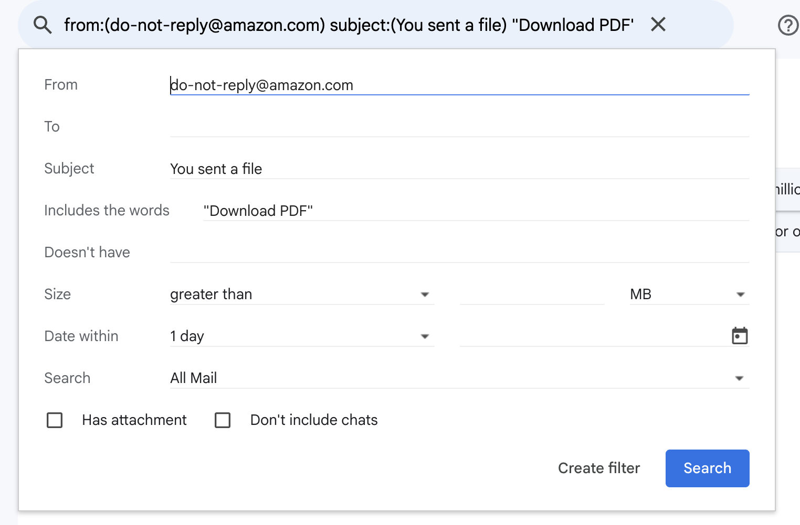

# stablio

## Configuring email filter




## Neon

Set `NEON_API_KEY` to an API key from Neon.

### Database Password

Currently there is an issue with the neon terraform provider returning all passwords as empty string: https://github.com/kislerdm/terraform-provider-neon/issues/51

Accordingly use the following to manually fetch the password and manually update the Secret Manager secret:

```
curl --request GET \
     --url https://console.neon.tech/api/v2/projects/$PROJECT_ID/branches/$BRANCH_ID/roles/mjwbenton/reveal_password \
     --header 'accept: application/json' \
     --header 'authorization: Bearer '$NEON_API_KEY
```

$PROJECT_ID and $BRANCH_ID are Terraform outputs from the `stablio-data` stack
